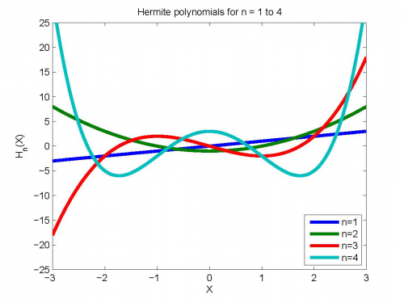

[](http://quantlet.de/)

## [](http://quantlet.de/) **HermPolyPlot** [](http://quantlet.de/)

```yaml

Name of QuantLet : HermPolyPlot

Published in : ADM

Description : 'Plots the first 4 Hermite polynomials on the given grid of values, probabilistic
version.'

Keywords : 'basis, orthogonal series, graphical representation, probability, graphical
representation, plot'

See also : hermitepoly

Author : Sergey Nasekin, Katerina Papagiannouli

Example : Plot of the first 4 Hermite polynomials

```




### MATLAB Code:
```matlab
clear
clc
close all
%plot the first 4 polynomials
x = -3:0.05:3;
n = 1:4;
% put here 'phys' as the third argument for the physisists' version 
% of Hermite polynomials; plots probabilistic version
% by default
y = hermitepoly(n,x);

plot(x,y,'LineWidth',3)
xlabel('X')
ylabel('H_n(X)')
title('Hermite polynomials for n = 1 to 4')
set(gca,'YLim',[-25 25])
legend(strcat('n=',num2str(n')),'Location','SouthEast')
```
